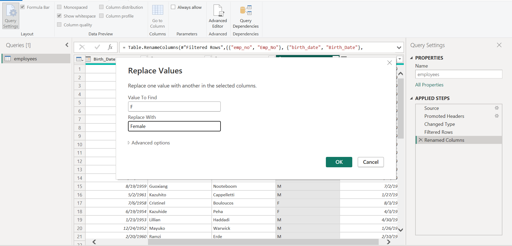

# Cleaning Sample Employee Datasets

## Introduction

In this Power Bi Task, We were Provided with a four tables for the employee (employee table,department table,dept_employee table and salary table). The project is to learn how to clean data in power query editor in Power Bi.
**_Disclamier_**:_All Dataset do not represent any individual, Institution or company ,but just a dummy set to demonstrate my knowledge of Power Bi._

-  Import employee table in power query editor,check there data quality

All the data in that table was ok

- I Adjusted the header to be readable.

- I replaced the M with Male and F with Female in the gender column
  

The Transformed Table

- In the Date of birth column, there i notice there a little mistake.Some of the year was 9999 instead of 1999, so i used the Find and replace icon.

- In imported other tables,using the New source ribbon in the power query editor

1. Department table

It is well cleaned but i just use the first column for the header

2. dept-emp table

There was also an error in the to_date column, I replaced the 9999 to 1999

3. Salary Table

This Table is very clean.

- Merging Tables
  I merged the table one after the other;
  The Employee + department = Merge 1,it was merge with the common column Emp_No
  
  Merge 1 Result
  
  
  Merge 1 + dept_Emp = Merge 2,It was merge with the Dept_No
  
  Merge 2 Result
  

  
  Merge 2 + Saleries = Merge 3,It was merge with the Emp_No
  
  Merge 3 Result
  
  
  
